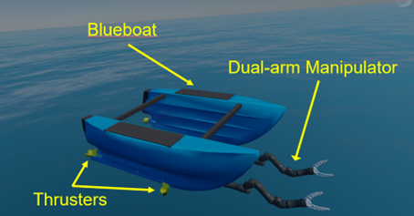
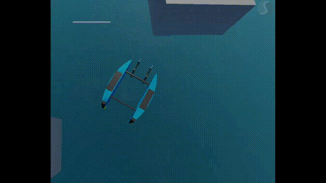

# Manipulator Control for Grasping Operations on Water Surface

This repository contains the source code for the EPS6 4th year project in Heriot Watt University titled  
**"Manipulator Control for Grasping Operations on Water Surface"**.

The project implements a dual-arm robotic system for grasping floating objects using **ROS2 Humble** and the **Stonefish** marine simulation platform.

The figure below shows the modified Blueboat platform equipped with two manipulators mounted at the front, and two added side thrusters.

<div align="center">
  
</div>

## Setup Instructions

This project uses the **Stonefish ROS2** marine simulation environment.  
The specific simulation world and robot configuration used in this project are adapted from:  
[markusbuchholz/stonefish_ros2_marine_robotics](https://github.com/Michele1996/stonefish_resources_pub)

Please refer to that repository for detailed instructions on installing Stonefish with ROS2 and Docker support.

### Prerequisites

- ROS2 Humble
- Docker with NVIDIA support
- Stonefish simulator:  
  https://github.com/patrykcieslak/stonefish

### Build and Launch

```bash
# Terminal 1: Launch the simulation environment
ros2 launch cola2_stonefish target_blueboat_alpha_launch.py

# Terminal 2: Broadcast the TF pose of the floating cylinder
ros2 run dual_arm_controller_pkg cyl_tf_broadcaster

# Terminal 3: Run Blueboat alignment controller (multi-stage PID)
ros2 run dual_arm_controller_pkg blueboat_controller

# Terminal 3 (after alignment is complete): Start the grasping logic
python3 target_two_clamp.py

# Terminal 4: Control the dual-arm manipulators for grasping
ros2 run dual_arm_controller_pkg target_dual_arm_controller

```

---

## Demo

### Platform Alignment (PID Control)

<div align="center">
  
</div>

This video shows the Blueboat platform aligning its orientation and position with the floating target using a four-stage PID strategy.

---

### Dual-Arm Grasp Execution

<div align="center">
  
</div>

This demo illustrates the coordinated grasping motion performed by the dual manipulators after successful alignment.


